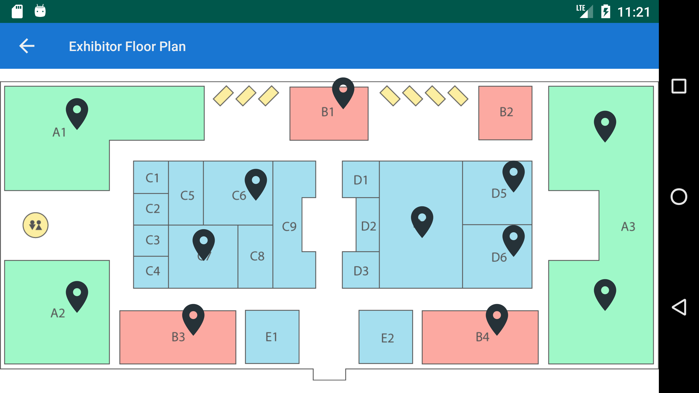
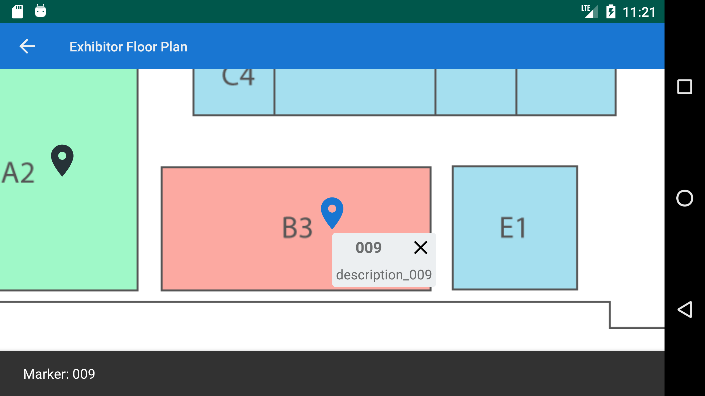
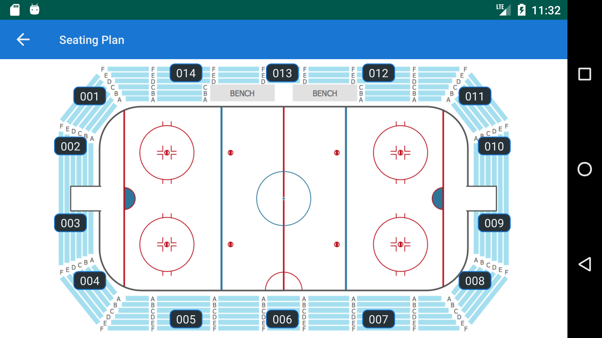
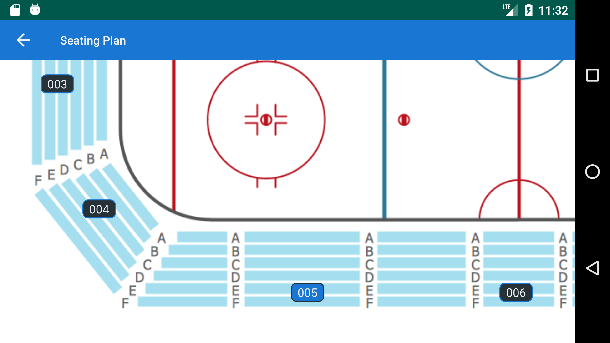

# EventMap  
  
A simple and easy implementation of scalable and draggable layout with smooth animation in Android.  
Basically, EventMap used to implement a simple map with custom markers, but other scenarios can be applied.  
Try the sample app to see `EventMap` in action.  
<p>  
  </p>  
<p>  
   </p>
 
## How to  
  
Add it in your root build.gradle at the end of repositories:  
```css
	allprojects {
		repositories {
			...
			maven { url 'https://jitpack.io' }
		}
	}
```
Add the dependency:
```css
	dependencies {
	        implementation 'com.github.shashavs:eventmap:1.0.0'
	}
```
## DragScaleLayout  
  
A container for views, which can be dragged and zoomed. DragScaleLayout supports three types of children: map, marker, info. Map is ImageView, marker and info are default or custom views. DragScaleLayout handles the following events: move, fling, double tap, scale. To the maptype view, the scale and translation actions is applied. For types of marker and info - only translation.  
  
## DragScaleLayout Example  

    <com.shashavs.eventmap.drag_scale.DragScaleLayout  
 android:id="@+id/map_container" android:layout_width="wrap_content" android:layout_height="wrap_content" android:animateLayoutChanges="true" app:maxZoom="1.5" app:mapScr="@drawable/seating_plan1"/>  
The map ImageView can be installed in xml - `mapScr` or programmatically via `getMapImageView()` method.  
 `addMarkerListenet(markerListener: MarkerListener)` - to get a click event on a marker.